# 🗺️ CODING ROADMAP - Dexter Vietnam

**Kế hoạch chi tiết để tự code từng module**

---

## 📚 Mục lục

1. [Giới thiệu](#giới-thiệu)
2. [Nhóm 1: Dữ liệu & Nền tảng](#nhóm-1-dữ-liệu--nền-tảng)
3. [Nhóm 2: Phân tích & Khám phá](#nhóm-2-phân-tích--khám-phá)
4. [Nhóm 3: Tương tác & Công cụ](#nhóm-3-tương-tác--công-cụ)
5. [Nhóm 4: Hạ tầng & AI](#nhóm-4-hạ-tầng--ai)

---

## Giới thiệu

### Thứ tự implement đề xuất

```mermaid
graph TD
    A[Core System] --> B[Module 1: TCBS Data]
    B --> C[Module 2: Fundamental Analysis]
    C --> D[Module 3: Technical Analysis]
    D --> E[Module 4: Money Flow]
    E --> F[Module 5: News & Events]
    F --> G[Module 6: Risk Management]
    G --> H[Nhóm 2: Analysis & Discovery]
    H --> I[Nhóm 3 & 4: Advanced Features]
```



### Cấu trúc mỗi module

Mỗi module nên có:
1. **Base class** kế thừa từ `BaseTool`
2. **API integration** hoặc data processing logic
3. **Error handling** và retry logic
4. **Unit tests**
5. **Documentation**

---

## Nhóm 1: Dữ liệu & Nền tảng

### ✅ Module 1: Hạ tầng Dữ liệu (PRIORITY: P0)

#### 1.1. TCBS Data Connector (`tools/vietnam/data/tcbs.py`)

**Mục tiêu:** Kết nối với TCBS API để lấy dữ liệu chứng khoán VN

**API Documentation:**
```python
# TCBS API Endpoints (FREE - không cần API key)
BASE_URL = "https://apipubaws.tcbs.com.vn"

# 1. Thông tin tổng quan cổ phiếu
GET /stock-insight/v1/stock/{symbol}/overview
# Response: { "ticker", "exchange", "industry", "companyType", ... }

# 2. Giá realtime
GET /stock-insight/v1/stock/bars-long-term?ticker={symbol}&type=stock&resolution=D&from={from_date}&to={to_date}
# Response: { "data": [{"tradingDate", "open", "high", "low", "close", "volume"}] }

# 3. Báo cáo tài chính
GET /stock-insight/v1/finance/{symbol}/financialreport?yearly=1&isAll=true
# Response: { "ticker", "revenue", "profit", "asset", ... }
```

**Implementation Steps:**

```python
# Step 1: Tạo class TCBSTool
import requests
from typing import Dict, Any, Optional
import pandas as pd

class TCBSTool(BaseTool):
    def __init__(self):
        self.base_url = "https://apipubaws.tcbs.com.vn"
        self.session = requests.Session()
    
    def get_stock_overview(self, symbol: str) -> Dict[str, Any]:
        """Lấy thông tin tổng quan cổ phiếu"""
        url = f"{self.base_url}/stock-insight/v1/stock/{symbol}/overview"
        response = self.session.get(url)
        return response.json()
    
    def get_stock_price(self, symbol: str, from_date: str, to_date: str) -> pd.DataFrame:
        """Lấy lịch sử giá cổ phiếu"""
        # TODO: Implement với retry logic
        pass
    
    def get_financial_report(self, symbol: str) -> Dict[str, Any]:
        """Lấy báo cáo tài chính"""
        # TODO: Implement
        pass

# Step 2: Test
# python
# from tools.vietnam.data.tcbs import TCBSTool
# tool = TCBSTool()
# print(tool.get_stock_overview("VNM"))
```

**Testing:**
```bash
# Tạo file tests/test_tcbs.py
pytest tests/test_tcbs.py -v
```

---

#### 1.2. SSI iBoard Connector (`tools/vietnam/data/ssi.py`)

**Mục tiêu:** Kết nối SSI iBoard API (Cần API key)

**API Documentation:**
- Đăng ký tại: https://iboard.ssi.com.vn/
- Docs: https://iboard.ssi.com.vn/api-docs

**Lưu ý:** SSI API cần authentication. Xem docs để lấy access token.

```python
class SSITool(BaseTool):
    def __init__(self, api_key: str, api_secret: str):
        self.api_key = api_key
        self.api_secret = api_secret
        self.access_token = None
    
    def authenticate(self):
        """Get access token"""
        # TODO: Implement OAuth flow
        pass
    
    def get_market_data(self, symbol: str):
        """Lấy dữ liệu thị trường"""
        # TODO: Implement
        pass
```

---

#### 1.3. CafeF Scraper (`tools/vietnam/data/cafef.py`)

**Mục tiêu:** Crawl dữ liệu từ CafeF (không có official API)

**Tech Stack:** BeautifulSoup4 hoặc Playwright

```python
from bs4 import BeautifulSoup
import requests

class CafeFTool(BaseTool):
    def __init__(self):
        self.base_url = "https://cafef.vn"
    
    def get_stock_analysis(self, symbol: str) -> Dict[str, Any]:
        """Crawl phân tích cổ phiếu từ CafeF"""
        url = f"{self.base_url}/company/{symbol}.chn"
        # TODO: Parse HTML và extract data
        pass
    
    def get_financial_ratios(self, symbol: str) -> Dict[str, Any]:
        """Crawl chỉ số tài chính"""
        # TODO: Implement
        pass
```

**⚠️ Lưu ý:** Cần respect robots.txt và rate limiting

---

### ✅ Module 2: Phân tích Cơ bản (PRIORITY: P0)

#### 2.1. Financial Statements (`tools/vietnam/fundamental/financial_statements.py`)

**Mục tiêu:** Đọc và parse báo cáo tài chính

**Các báo cáo cần xử lý:**
1. Bảng cân đối kế toán (Balance Sheet)
2. Báo cáo kết quả kinh doanh (Income Statement)
3. Báo cáo lưu chuyển tiền tệ (Cash Flow Statement)

```python
class FinancialStatementTool(BaseTool):
    def parse_balance_sheet(self, data: Dict) -> Dict:
        """
        Parse bảng cân đối kế toán
        - Tài sản (Assets)
        - Nợ phải trả (Liabilities)
        - Vốn chủ sở hữu (Equity)
        """
        # TODO: Implement
        pass
    
    def parse_income_statement(self, data: Dict) -> Dict:
        """
        Parse báo cáo kết quả kinh doanh
        - Doanh thu (Revenue)
        - Giá vốn (COGS)
        - Lợi nhuận (Profit)
        """
        # TODO: Implement
        pass
    
    def parse_cashflow_statement(self, data: Dict) -> Dict:
        """Parse lưu chuyển tiền tệ"""
        # TODO: Implement
        pass
```

---

#### 2.2. Financial Ratios (`tools/vietnam/fundamental/ratios.py`)

**Mục tiêu:** Tính toán các chỉ số tài chính

**Các chỉ số quan trọng:**

```python
class FinancialRatiosTool(BaseTool):
    def calculate_pe_ratio(self, price: float, eps: float) -> float:
        """P/E = Price / EPS"""
        return price / eps if eps != 0 else None
    
    def calculate_pb_ratio(self, price: float, book_value_per_share: float) -> float:
        """P/B = Price / Book Value per Share"""
        return price / book_value_per_share if book_value_per_share != 0 else None
    
    def calculate_roe(self, net_income: float, equity: float) -> float:
        """ROE = Net Income / Shareholder's Equity"""
        return (net_income / equity) * 100 if equity != 0 else None
    
    def calculate_roa(self, net_income: float, total_assets: float) -> float:
        """ROA = Net Income / Total Assets"""
        return (net_income / total_assets) * 100 if total_assets != 0 else None
    
    def calculate_debt_to_equity(self, total_debt: float, equity: float) -> float:
        """D/E = Total Debt / Equity"""
        return total_debt / equity if equity != 0 else None
    
    def calculate_current_ratio(self, current_assets: float, current_liabilities: float) -> float:
        """Current Ratio = Current Assets / Current Liabilities"""
        return current_assets / current_liabilities if current_liabilities != 0 else None
    
    def calculate_all_ratios(self, financial_data: Dict) -> Dict:
        """Tính tất cả chỉ số"""
        # TODO: Implement
        pass
```

---

#### 2.3. DCF Valuation (`tools/vietnam/fundamental/dcf_valuation.py`)

**Mục tiêu:** Định giá cổ phiếu bằng phương pháp DCF (Discounted Cash Flow)

**Formula:**
```
DCF = Σ (CF_t / (1 + r)^t) + Terminal Value / (1 + r)^n
```

```python
class DCFValuationTool(BaseTool):
    def calculate_wacc(self, risk_free_rate: float, beta: float, market_return: float, 
                       debt_ratio: float, tax_rate: float) -> float:
        """
        Tính WACC (Weighted Average Cost of Capital)
        WACC = (E/V) * Re + (D/V) * Rd * (1 - Tax)
        """
        # TODO: Implement
        pass
    
    def project_cash_flows(self, historical_fcf: list, growth_rate: float, years: int) -> list:
        """Dự báo dòng tiền tự do"""
        # TODO: Implement
        pass
    
    def calculate_terminal_value(self, final_fcf: float, growth_rate: float, wacc: float) -> float:
        """Terminal Value = FCF_n * (1 + g) / (WACC - g)"""
        return (final_fcf * (1 + growth_rate)) / (wacc - growth_rate)
    
    def calculate_intrinsic_value(self, symbol: str) -> Dict:
        """Tính giá trị nội tại của cổ phiếu"""
        # TODO: Implement full DCF model
        pass
```

---

### ✅ Module 3: Phân tích Kỹ thuật (PRIORITY: P0)

#### 3.1. Technical Indicators (`tools/vietnam/technical/indicators.py`)

**Mục tiêu:** Tính các chỉ báo kỹ thuật

**Sử dụng thư viện `ta` (Technical Analysis):**

```python
import pandas as pd
from ta.momentum import RSIIndicator, StochasticOscillator
from ta.trend import MACD, EMAIndicator, SMAIndicator
from ta.volatility import BollingerBands

class TechnicalIndicatorsTool(BaseTool):
    def calculate_rsi(self, prices: pd.Series, period: int = 14) -> pd.Series:
        """
        RSI (Relative Strength Index)
        - RSI > 70: Overbought (quá mua)
        - RSI < 30: Oversold (quá bán)
        """
        rsi = RSIIndicator(close=prices, window=period)
        return rsi.rsi()
    
    def calculate_macd(self, prices: pd.Series) -> Dict[str, pd.Series]:
        """
        MACD (Moving Average Convergence Divergence)
        Returns: {
            'macd': MACD line,
            'signal': Signal line,
            'histogram': MACD histogram
        }
        """
        macd = MACD(close=prices)
        return {
            'macd': macd.macd(),
            'signal': macd.macd_signal(),
            'histogram': macd.macd_diff()
        }
    
    def calculate_bollinger_bands(self, prices: pd.Series, period: int = 20) -> Dict:
        """Bollinger Bands"""
        bb = BollingerBands(close=prices, window=period)
        return {
            'upper': bb.bollinger_hband(),
            'middle': bb.bollinger_mavg(),
            'lower': bb.bollinger_lband()
        }
    
    def calculate_ema(self, prices: pd.Series, period: int) -> pd.Series:
        """EMA (Exponential Moving Average)"""
        ema = EMAIndicator(close=prices, window=period)
        return ema.ema_indicator()
    
    def calculate_all_indicators(self, df: pd.DataFrame) -> pd.DataFrame:
        """Tính tất cả indicators và thêm vào DataFrame"""
        # TODO: Calculate all and merge
        pass
```

---

#### 3.2. Trading Signals (`tools/vietnam/technical/signals.py`)

**Mục tiêu:** Sinh tín hiệu mua/bán

```python
class TradingSignalsTool(BaseTool):
    def detect_rsi_signals(self, rsi: pd.Series) -> pd.Series:
        """
        Phát hiện tín hiệu từ RSI
        - BUY: RSI < 30 (oversold)
        - SELL: RSI > 70 (overbought)
        """
        signals = pd.Series(index=rsi.index, data='HOLD')
        signals[rsi < 30] = 'BUY'
        signals[rsi > 70] = 'SELL'
        return signals
    
    def detect_macd_crossover(self, macd: pd.Series, signal: pd.Series) -> pd.Series:
        """
        Phát hiện MACD crossover
        - BUY: MACD cắt lên Signal
        - SELL: MACD cắt xuống Signal
        """
        # TODO: Implement crossover detection
        pass
    
    def detect_golden_cross(self, short_ma: pd.Series, long_ma: pd.Series) -> pd.Series:
        """
        Golden Cross / Death Cross
        - Golden Cross (BUY): MA ngắn cắt lên MA dài
        - Death Cross (SELL): MA ngắn cắt xuống MA dài
        """
        # TODO: Implement
        pass
```

---

### ✅ Module 4: Dòng Tiền (PRIORITY: P1)

#### 4.1. Foreign Trading (`tools/vietnam/money_flow/foreign.py`)

**Mục tiêu:** Theo dõi giao dịch khối ngoại

```python
class ForeignTradingTool(BaseTool):
    def get_foreign_trading(self, symbol: str = None, date: str = None) -> pd.DataFrame:
        """
        Lấy dữ liệu giao dịch khối ngoại
        Returns: DataFrame với columns:
        - symbol
        - buy_volume
        - sell_volume
        - net_volume (mua ròng)
        - buy_value
        - sell_value
        - net_value
        """
        # TODO: Get data từ TCBS hoặc SSI
        pass
    
    def get_top_foreign_buying(self, top_n: int = 10) -> pd.DataFrame:
        """Top N cổ phiếu khối ngoại mua ròng nhiều nhất"""
        # TODO: Implement
        pass
    
    def get_top_foreign_selling(self, top_n: int = 10) -> pd.DataFrame:
        """Top N cổ phiếu khối ngoại bán ròng nhiều nhất"""
        # TODO: Implement
        pass
```

---

### ✅ Module 5: Tin tức & Sự kiện (PRIORITY: P1)

#### 5.1. News Aggregator (`tools/vietnam/news/aggregator.py`)

**Nguồn tin:**
- CafeF
- VnExpress Kinh doanh
- Đầu tư Chứng khoán
- Vietstock

```python
class NewsAggregatorTool(BaseTool):
    def get_latest_news(self, symbol: str = None, limit: int = 10) -> list:
        """Lấy tin tức mới nhất"""
        # TODO: Crawl from multiple sources
        pass
    
    def search_news(self, keyword: str, from_date: str, to_date: str) -> list:
        """Tìm kiếm tin tức theo keyword"""
        # TODO: Implement
        pass
```

---

#### 5.2. Sentiment Analysis (`tools/vietnam/news/sentiment.py`)

**Mục tiêu:** Phân tích tâm lý từ tin tức

**Sử dụng LLM:**

```python
from model.llm import LLMWrapper

class SentimentAnalysisTool(BaseTool):
    def __init__(self):
        self.llm = LLMWrapper()
    
    def analyze_sentiment(self, text: str) -> Dict:
        """
        Phân tích tâm lý của bài báo
        Returns: {
            'sentiment': 'positive' | 'negative' | 'neutral',
            'score': 0.0 - 1.0,
            'reasoning': 'Lý do đánh giá'
        }
        """
        prompt = f"""
        Phân tích tâm lý của bài báo sau về chứng khoán:
        
        {text}
        
        Đánh giá:
        - Tích cực (positive): Tin tốt cho cổ phiếu
        - Tiêu cực (negative): Tin xấu cho cổ phiếu
        - Trung lập (neutral): Không ảnh hưởng rõ ràng
        
        Trả về JSON format: {{"sentiment": "...", "score": ..., "reasoning": "..."}}
        """
        # TODO: Call LLM và parse response
        pass
```

---

### ✅ Module 6: Quản lý Rủi ro (PRIORITY: P2)

#### 6.1. Company Risk (`tools/vietnam/risk/company_risk.py`)

```python
class CompanyRiskTool(BaseTool):
    def calculate_altman_z_score(self, financial_data: Dict) -> float:
        """
        Altman Z-Score để dự đoán phá sản
        Z = 1.2*X1 + 1.4*X2 + 3.3*X3 + 0.6*X4 + 1.0*X5
        
        - Z > 2.99: An toàn
        - 1.81 < Z < 2.99: Cảnh báo
        - Z < 1.81: Nguy hiểm
        """
        # TODO: Implement
        pass
    
    def assess_liquidity_risk(self, current_ratio: float, quick_ratio: float) -> str:
        """Đánh giá rủi ro thanh khoản"""
        # TODO: Implement
        pass
```

---

## Nhóm 2: Phân tích & Khám phá

### ✅ Module 7: Stock Screening (PRIORITY: P2)

```python
class StockScreeningTool(BaseTool):
    def screen_value_stocks(self, criteria: Dict) -> pd.DataFrame:
        """
        Lọc cổ phiếu giá trị
        Criteria:
        - P/E < 15
        - P/B < 1.5
        - ROE > 15%
        - D/E < 1
        """
        # TODO: Implement
        pass
    
    def screen_growth_stocks(self, criteria: Dict) -> pd.DataFrame:
        """Lọc cổ phiếu tăng trưởng"""
        # TODO: Implement
        pass
```

---

### ✅ Module 10: Market Overview (PRIORITY: P1)

```python
class MarketOverviewTool(BaseTool):
    def get_market_status(self) -> Dict:
        """
        Lấy trạng thái thị trường
        Returns: {
            'vnindex': {...},
            'hnx': {...},
            'upcom': {...},
            'top_gainers': [...],
            'top_losers': [...]
        }
        """
        # TODO: Implement
        pass
    
    def get_sector_performance(self) -> pd.DataFrame:
        """Hiệu suất các ngành"""
        # TODO: Implement
        pass
```

---

---

## Nhóm 3: Tương tác & Công cụ (PRIORITY: P3)

### ✅ Module 11: Alerts (`tools/vietnam/alerts/manager.py`)

**Mục tiêu:** Quản lý và gửi cảnh báo

```python
class AlertManagerTool(BaseTool):
    def create_price_alert(self, symbol: str, target_price: float, condition: str) -> str:
        """
        Tạo cảnh báo giá
        Condition: 'above', 'below'
        """
        # TODO: Store alert in database
        pass
    
    def check_alerts(self, current_prices: Dict[str, float]) -> List[Dict]:
        """Kiểm tra xem có alert nào khớp không"""
        # TODO: Check current prices against alerts
        pass
```

---

### ✅ Module 12: Reporting (`tools/vietnam/reporting/generator.py`)

**Mục tiêu:** Tạo báo cáo định kỳ

```python
class ReportGeneratorTool(BaseTool):
    def generate_daily_report(self, portfolio_id: str) -> str:
        """
        Tạo báo cáo ngày:
        - Biến động tài sản
        - Top gainers/losers trong danh mục
        - Tin tức quan trọng
        """
        # TODO: Aggregate data & format string/html
        pass
```

---

### ✅ Module 13: Calculators (`tools/vietnam/calculators/basic.py`)

**Mục tiêu:** Các công cụ tính toán tiện ích

```python
class InvestmentCalculatorTool(BaseTool):
    def calculate_compound_interest(self, principal: float, rate: float, time: int, monthly_contribution: float) -> float:
        """Tính lãi kép"""
        # TODO: Implement formula
        pass
    
    def calculate_position_sizing(self, capital: float, risk_per_trade: float, entry: float, stop_loss: float) -> float:
        """Tính khối lượng vào lệnh dựa trên rủi ro"""
        # TODO: Implement
        pass
```

---

### ✅ Module 14: Education (`tools/vietnam/education/knowledge.py`)

```python
class EducationTool(BaseTool):
    def get_term_definition(self, term: str) -> str:
        """Giải thích thuật ngữ (VD: 'Bán khống là gì?')"""
        # TODO: Search in local knowledge base or vector DB
        pass
```

---

### ✅ Module 15: Social (`tools/vietnam/social/community.py`)

```python
class SocialTool(BaseTool):
    def get_top_portfolios(self) -> List[Dict]:
        """Lấy danh sách các danh mục đầu tư hiệu quả nhất"""
        # TODO: Query leaderboard
        pass
```

---

## Nhóm 4: Hạ tầng & AI (PRIORITY: P4)

### ✅ Module 17: Advanced AI (`tools/vietnam/ai/prediction.py`)

**Mục tiêu:** Dự báo nâng cao dùng Machine Learning

```python
class PricePredictionTool(BaseTool):
    def predict_next_day(self, symbol: str) -> Dict:
        """Dự báo xu hướng ngày mai dùng LSTM/Transformer"""
        # TODO: Load pre-trained model & predict
        pass
```

### ✅ Module 18: Premium Features (`tools/vietnam/premium/level2.py`)

**Mục tiêu:** Dữ liệu chuyên sâu

```python
class Level2DataTool(BaseTool):
    def get_market_depth(self, symbol: str) -> Dict:
        """Lấy dữ liệu khớp lệnh 10 bước giá"""
        # TODO: Connect to Premium API providers
        pass
```

---

## Agent Core System

### Agent Orchestrator (`agent/orchestrator.py`)

```python
from typing import List
from tools.registry import ToolRegistry
from model.llm import LLMWrapper

class Agent:
    def __init__(self):
        self.llm = LLMWrapper()
        self.tool_registry = ToolRegistry()
        self.conversation_history = []
    
    async def run(self, query: str) -> str:
        """
        Main agent loop:
        1. Plan: Phân tích query và lập kế hoạch
        2. Execute: Gọi tools cần thiết
        3. Synthesize: Tổng hợp kết quả
        """
        # TODO: Implement agent loop
        pass
    
    def plan(self, query: str) -> List[str]:
        """Lập kế hoạch - tools nào cần gọi"""
        # TODO: Use LLM to plan
        pass
    
    async def execute_tools(self, plan: List[str]) -> Dict:
        """Execute các tools"""
        # TODO: Implement
        pass
    
    def synthesize(self, results: Dict, query: str) -> str:
        """Tổng hợp kết quả thành câu trả lời"""
        # TODO: Use LLM to synthesize
        pass
```

---

## Testing Strategy

### Unit Tests

```python
# tests/test_tcbs.py
import pytest
from tools.vietnam.data.tcbs import TCBSTool

def test_get_stock_overview():
    tool = TCBSTool()
    result = tool.get_stock_overview("VNM")
    assert result is not None
    assert 'ticker' in result

def test_get_stock_price():
    tool = TCBSTool()
    df = tool.get_stock_price("VNM", "2024-01-01", "2024-12-31")
    assert not df.empty
```

---

## Deployment

### Docker

```dockerfile
# Dockerfile
FROM python:3.11-slim

WORKDIR /app
COPY requirements.txt .
RUN pip install -r requirements.txt

COPY . .

CMD ["python", "main.py"]
```

---

## Tài liệu tham khảo

### APIs
- TCBS API: https://apipubaws.tcbs.com.vn
- SSI iBoard: https://iboard.ssi.com.vn/
- vnstock library: https://github.com/thinh-vu/vnstock

### Libraries
- pandas: Data manipulation
- ta: Technical Analysis
- requests: HTTP requests
- beautifulsoup4: Web scraping
- langchain: LLM integration

---

## Lộ trình implement theo tuần (8 tuần)

### 🗓️ Tuần 1-2: Core Infrastructure (Nhóm 1 - Phần 1)
- [x] Setup project structure
- [ ] **Module 1**: TCBS connector (get_stock_overview, get_stock_price, get_financial_report)
- [ ] **Module 1**: SSI connector (authentication, get_market_data)
- [ ] **Module 1**: CafeF scraper (get_stock_analysis, get_financial_ratios)
- [ ] **Module 2**: Financial statements parser (balance sheet, income statement, cash flow)
- [ ] **Module 2**: Ratios calculator (P/E, P/B, ROE, ROA, D/E)
- [ ] **Module 2**: DCF valuation (WACC, cash flow projection, intrinsic value)
- [ ] Base tool system & registry
- [ ] Unit tests cho data connectors

### 🗓️ Tuần 3: Technical Analysis (Nhóm 1 - Phần 2)
- [ ] **Module 3**: Technical indicators (RSI, MACD, Bollinger Bands, EMA, SMA)
- [ ] **Module 3**: Trading signals (RSI signals, MACD crossover, Golden/Death cross)
- [ ] **Module 3**: Pattern detection (support/resistance, trend lines)
- [ ] Integration tests với real market data

### 🗓️ Tuần 4: Money Flow & News (Nhóm 1 - Phần 3)
- [ ] **Module 4**: Foreign trading tracker (net buy/sell, top stocks)
- [ ] **Module 4**: Proprietary trading monitor
- [ ] **Module 4**: Insider trading tracker
- [ ] **Module 5**: News aggregator (CafeF, VnExpress, Vietstock)
- [ ] **Module 5**: Sentiment analysis với LLM
- [ ] **Module 5**: Events calendar (dividends, AGM, new issuance)

### 🗓️ Tuần 5: Risk & Screening (Nhóm 1 & 2)
- [ ] **Module 6**: Company risk assessment (Altman Z-score, liquidity risk)
- [ ] **Module 6**: Portfolio risk management
- [ ] **Module 7**: Stock screening (value stocks, growth stocks, oversold)
- [ ] **Module 10**: Market overview (VN-Index, HNX, UPCOM status)
- [ ] **Module 10**: Sector analysis (banking, steel, real estate, oil & gas)
- [ ] **Module 10**: Macro indicators (interest rate, inflation, GDP)

### 🗓️ Tuần 6: Agent Core System
- [ ] Agent orchestrator (main loop: plan → execute → synthesize)
- [ ] Planner logic (LLM-based planning)
- [ ] Tool executor (parallel tool execution)
- [ ] Response synthesizer (LLM-based synthesis)
- [ ] Conversation memory & history
- [ ] CLI interface với rich/click
- [ ] Error handling & retry logic

### 🗓️ Tuần 7: Interaction Tools (Nhóm 3)
- [ ] **Module 11**: Alert system (price alerts, news alerts, foreign flow alerts)
- [ ] **Module 12**: Report generator (daily/weekly/monthly reports, PDF export)
- [ ] **Module 13**: Investment calculators (compound interest, position sizing, tax calculator)
- [ ] **Module 14**: Education knowledge base (term definitions, tutorials, case studies)
- [ ] **Module 15**: Social/community features (top portfolios, leaderboard)

### 🗓️ Tuần 8: Advanced Features & Polish (Nhóm 4)
- [ ] **Module 17**: AI prediction models (LSTM/Transformer for price prediction)
- [ ] **Module 17**: Anomaly detection in financial reports
- [ ] **Module 18**: Premium data integration (Level 2 data, market depth)
- [ ] **Module 16**: Performance optimization (caching, async operations)
- [ ] **Module 16**: Security hardening (API key management, rate limiting)
- [ ] End-to-end testing
- [ ] Documentation (API docs, user guide)
- [ ] Deployment setup (Docker, docker-compose)

---

## 📊 Tổng kết Modules

| Module | Tên | Priority | Tuần | Status |
|--------|-----|----------|------|--------|
| 1 | Data Infrastructure | P0 | 1-2 | 🟡 In Progress |
| 2 | Fundamental Analysis | P0 | 1-2 | ⚪ Not Started |
| 3 | Technical Analysis | P0 | 3 | ⚪ Not Started |
| 4 | Money Flow | P1 | 4 | ⚪ Not Started |
| 5 | News & Events | P1 | 4 | ⚪ Not Started |
| 6 | Risk Management | P2 | 5 | ⚪ Not Started |
| 7 | Stock Screening | P2 | 5 | ⚪ Not Started |
| 8 | Personalization | P3 | - | ⚪ Future |
| 9 | Backtesting | P3 | - | ⚪ Future |
| 10 | Market Overview | P1 | 5 | ⚪ Not Started |
| 11 | Alerts | P3 | 7 | ⚪ Not Started |
| 12 | Reporting | P3 | 7 | ⚪ Not Started |
| 13 | Calculators | P3 | 7 | ⚪ Not Started |
| 14 | Education | P3 | 7 | ⚪ Not Started |
| 15 | Social | P3 | 7 | ⚪ Not Started |
| 16 | Infrastructure | P4 | 8 | ⚪ Not Started |
| 17 | Advanced AI | P4 | 8 | ⚪ Not Started |
| 18 | Premium Features | P4 | 8 | ⚪ Not Started |

---

## 🎯 Mục tiêu hoàn thành

### MVP (Minimum Viable Product) - Tuần 1-5
Sau 5 tuần, bạn sẽ có một **AI Trading Assistant cơ bản** với:
- ✅ Lấy dữ liệu realtime từ TCBS (giá, báo cáo tài chính)
- ✅ Phân tích cơ bản (P/E, ROE, ROA, DCF valuation)
- ✅ Phân tích kỹ thuật (RSI, MACD, Bollinger Bands, tín hiệu mua/bán)
- ✅ Theo dõi dòng tiền khối ngoại
- ✅ Tin tức + Phân tích tâm lý (sentiment)
- ✅ Đánh giá rủi ro công ty
- ✅ Sàng lọc cổ phiếu theo tiêu chí
- ✅ AI Agent có thể trả lời: "Phân tích cổ phiếu VNM", "Khối ngoại mua gì hôm nay?"

**Ví dụ queries MVP có thể xử lý:**
```
User: "Phân tích cổ phiếu VNM"
Agent: [Gọi TCBS] → [Tính P/E, ROE] → [Tính RSI, MACD] → "VNM đang có P/E = 15.2, ROE = 18%, RSI = 45 (trung lập)..."

User: "Khối ngoại hôm nay mua gì?"
Agent: [Gọi Foreign Trading API] → "Top 3 mua ròng: VNM (+2.5M), FPT (+1.8M), VCB (+1.2M)"
```

### Full Product - Tuần 6-8
Sau 8 tuần, bạn sẽ có **sản phẩm hoàn chỉnh** với:
- ✅ CLI interface đẹp mắt (rich console)
- ✅ Alert system (cảnh báo qua email/telegram)
- ✅ Báo cáo tự động (PDF/HTML)
- ✅ Công cụ tính toán đầu tư
- ✅ AI dự báo giá (ML models)
- ✅ Premium features (Level 2 data)
- ✅ Tối ưu performance & bảo mật

---

## 🚀 Quick Start Guide

### Bắt đầu code ngay hôm nay:

```bash
# 1. Setup environment
cd dexter_vietnam
python -m venv venv
source venv/bin/activate  # hoặc venv\Scripts\activate trên Windows
pip install -r requirements.txt

# 2. Tạo .env file
cp .env.example .env
# Điền OPENAI_API_KEY hoặc GOOGLE_API_KEY

# 3. Bắt đầu với Module 1: TCBS Connector
# Mở file: tools/vietnam/data/tcbs.py
# Follow TODO comments và implement từng function

# 4. Test
python -c "from tools.vietnam.data.tcbs import TCBSTool; print(TCBSTool().get_stock_overview('VNM'))"
```

---

**Chúc bạn code vui vẻ! 🚀**

*Lưu ý: Modules 8 (Personalization) và 9 (Backtesting) được đánh dấu "Future" vì cần có user data trước. Có thể implement sau khi có người dùng thực tế.*
